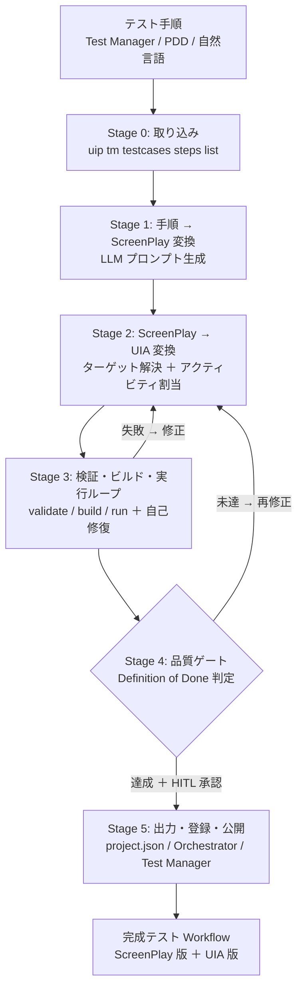
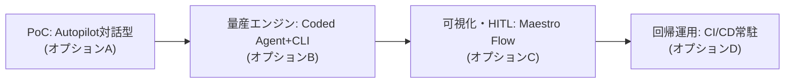
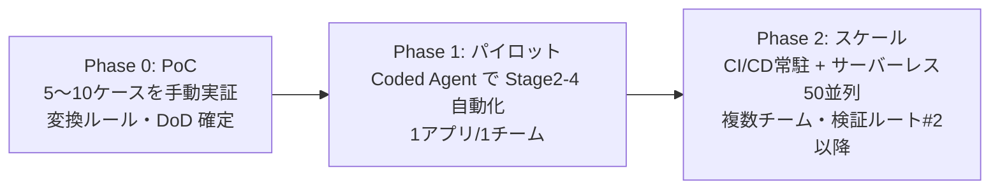

# テスト用 Workflow 生産工場 — ハーネス設計ガイド（検証ルート#1）

- **目的**: Test Cloud 日本市場展開の障壁（テスト WF 開発の難しさ・保守負荷・実行性能）を、「ScreenPlay で易しくオーサリング → UIAutomation へ変換して高速実行」する自動生産ラインで解消する。
- **入力**: Test Cloud / Test Manager のテストケース手順ステップ（自然言語）
- **出力**: 品質基準（Definition of Done）を満たした完成テスト Workflow（ScreenPlay 版 ＋ UIAutomation 版）
- **前提実証**: 本ガイドは、直近に手作業で通した実フロー（Test Manager 手順抽出 `HNTS:5` → ScreenPlay 生成 → UIA 変換 → validate/build 検証）を「反復可能な工場（ハーネス）」へ産業化する設計。

---

## 1. 戦略の核心：「オーサリングは易しく、実行は速く」の二層モデル

顧客課題と、本アプローチによる解決の対応:

| 顧客の課題 | 従来の痛み | 本工場での解決 |
|---|---|---|
| **技術的に難しい** | セレクター/UI 操作の専門知識が要る | **ScreenPlay**：自然言語プロンプトで手順を書くだけ。AI が UI を解釈。テスト要員はコード/セレクター知識不要 |
| **保守が大変** | UI 変更でセレクターが壊れ、都度修正 | ScreenPlay の**自己修復（AI ターゲティング）** ＋ 工場が手順から**再生成**。差分は手順の更新で吸収 |
| **実行性能が遅い** | ScreenPlay は柔軟だが LLM 呼び出しで低速・コスト高 | **UIAutomation へ変換**して決定論的・高速・低コストに実行 |

**核心**: ScreenPlay で「速く・易しく」作り、UIA へ変換して「速く・安定」に回す。工場（ハーネス）はこの**変換**と**品質保証ループ**を自動化する。ScreenPlay は「実行資産」ではなく「**仕様＝実行可能な受け入れ基準**」として使い、UIA を量産物とみなすのが要点。

---

## 2. リファレンスアーキテクチャ（パイプライン）



**設計原則**
1. **各ステージは疎結合**（入力→処理→出力の契約を固定）。ステージ単位で差し替え・並列化・再実行が可能。
2. **冪等性**：同じ手順から同じ WF を再生成できる（GUID・命名・構造のルールを固定）。
3. **人間はゲートに立つ**（HITL）：全自動ではなく「品質ゲートの承認」に人を置き、責任と説明可能性を担保。
4. **成果物は二層で保存**：ScreenPlay 版（仕様・回帰の可読ソース）と UIA 版（高速実行物）を両方バージョン管理。

---

## 3. 重要な前提（2026年時点の製品調査結果）

| 論点 | 調査結果 | 工場設計への含意 |
|---|---|---|
| ScreenPlay | **GA**（2025/12、`UiPath.Semantic.Activities.NUITask`）。自然言語 `Task`/`Prompt` を Large Action Model が解釈。自己修復あり。決定論アクティビティより低速・高コスト | オーサリング層として最適。実行資産にはしない |
| Autopilot for Testing | **GA**。手順/要件から**手動テストケース生成**、**Coded Test Case 生成**、テストデータ生成、API テスト生成 | Stage 0-1 の一部を製品機能で代替可。再発明しない |
| **ScreenPlay → UIA 変換** | **公式機能は存在しない**。ScreenPlay 実行時に **HTMLトレース（解決済みセレクター・信頼度・OTELスパン）** を出力 | **← ここが本工場の中核差別化**。トレース or Object Repository を使い自動変換する |
| Semantic Selectors / OR | Semantic Selectors は GA（意味ベース照合、healing フォールバック）。Clipboard AI で OR 一括取り込み | 変換後 UIA の堅牢化・フォールバックに活用 |
| Test Cloud 実行 | サーバーレスロボット（0.1〜1.0 PU/分、最大50並列、コールドスタート10〜30秒）。東京データレジデンシー・日本語UI | 量産テストの実行基盤。**Windows デスクトップUIはVM/オンプレ必要（サーバーレス非対応）** |
| CLI/CI | `uip tm`(testsets run/wait/report/result)・`uip rpa`(validate/build/pack)・`uip or packages upload`。Azure DevOps/GitHub/Jenkins レシピ、JUnit 出力 | ヘッドレス工場のオーケストレーション基盤 |

> **結論**: 上流（手順→手動テスト→ScreenPlay/Coded）は **Autopilot for Testing** を活用し、**「ScreenPlay → 高速UIA 変換 ＋ 品質保証ループ」という UiPath に無い部分に自作ハーネスを集中投資**するのが最短。今セッションで手動実証した変換フローが、まさにこの欠落機能のプロトタイプ。

---

## 4. パイプライン各ステージ詳細

### Stage 0 — 取り込み（Ingest）
- **入力**: Test Manager のテストケース手順（例 `HNTS:5`）
- **ツール**:
  - `uip tm testcases list --project-key <P> --filter <KEY>` → テストケース UUID 解決
  - `uip tm testcases steps list --test-case-id <UUID> --output json` → 手順ステップを構造化取得
- **出力**: 正規化した手順配列（`{順序, 操作, 対象, 入力値, 期待結果}`）
- **代替**: 要件からの手動テストケース生成は Autopilot for Testing（最大50件/50ステップ）

### Stage 1 — 手順 → ScreenPlay 変換（Prompt 合成）
- **処理**: 各手順を 1 つの ScreenPlay（`NUITask`）の `Prompt`（自然言語指示）へマッピング。パラメータ化対象（例: メールアドレス）は `In` 引数化して式に差し込む
- **出力**: ScreenPlay 版 `.xaml`（`NApplicationCard` スコープ ＋ ステップ毎の `NUITask`）
- **キー**: 1 手順 = 1 `NUITask`（保守性・トレーサビリティ）。期待結果は検証系ステップに

### Stage 2 — ScreenPlay → UIA 変換（工場の心臓部・公式機能なし）
1 手順の ScreenPlay 意図を、決定論的 UIA アクティビティ＋実ターゲットへ変換。**ターゲット解決に 3 戦略**:

| 戦略 | 方法 | 適する場面 |
|---|---|---|
| **A. トレース収穫** | ScreenPlay を1回実行 → HTML/OTEL トレースから**解決済みセレクター**を抽出 → 決定論アクティビティに転写 | ライブアプリがあり、AI に一度解かせたい |
| **B. Object Repository 再利用** | 事前に OR へ要素を取り込み、ScreenPlay/UIA 双方から参照（今セッションの実証方式） | 同一画面の資産を継続活用 |
| **C. ライブキャプチャ** | `uia-configure-target` で各要素を都度取得 | 初回・OR 未整備 |

- **アクティビティ割当（意味 → 決定論）**:

| ScreenPlay の意図 | UIA アクティビティ | 主要プロパティ |
|---|---|---|
| 「〜に入力する」 | `NTypeInto` | `Text`（値/引数）＋ Target |
| 「〜をクリック」 | `NClick` | `ClickType` ＋ Target |
| 「ドロップダウンから選択」 | `NSelectItem` | `Item` ＋ Target |
| 「〜が表示/取得」 | `NGetText` | `TextString`（出力変数）＋ Target |
| 「〜を検証/確認」 | `VerifyExpression`（Testing） | `Expression` |
| 「画面へ遷移/開く」 | `NApplicationCard` | `TargetApp`(URL/Selector) |

- **出力**: UIA 版 `.xaml`（同一 `ScopeGuid` を全 UIA アクティビティで共有、`In` 引数維持）

### Stage 3 — 検証・ビルド・実行ループ（自己修復）
- `uip rpa validate --file-path <F> --project-dir <P> --output json` → 構造/参照/アナライザ（0エラーまで）
- `uip rpa build <P> --output json` → メンバー/列挙子解決（`validate` が見逃す層）
- `uip rpa run`（またはテストセット実行）→ 実行検証。失敗は Stage 2 へ差し戻し、修正→再試行（最大 n 回）
- **自己修復の材料**: 実行トレース・失敗セレクター・スクショ。LLM に渡して次の修正案を生成

### Stage 4 — 品質ゲート（Definition of Done 判定）
- 下記チェックリスト（§5）を機械判定。未達は Stage 2 へ、達成かつ **HITL 承認**で Stage 5 へ

### Stage 5 — 出力・登録・公開
- `project.json` の `fileInfoCollection` へテストケース登録
- `uip rpa pack` → `uip or packages upload` → Test Manager でテストケースへ automation をリンク
- テストセット実行: `uip tm testsets run` → `uip tm wait` → `uip tm report get` / `result download`（JUnit）

---

## 5. 品質基準（Definition of Done）チェックリスト

工場が「完成」と判定するための機械・人手併用ゲート。全項目 ✅ かつ HITL 承認で出荷。

**静的品質**
- [ ] `uip rpa validate`：全ファイル 0 エラー・0 警告（アナライザ含む）
- [ ] `uip rpa build`：`Success: true`（メンバー名・列挙子・式の解決を含む）
- [ ] 命名規則準拠（テストケース名 = 手順名、UIA 版は `_UIA変換` 等の接尾辞で識別）
- [ ] `project.json` の `fileInfoCollection` に登録済み（testCaseId 採番）

**構造品質**
- [ ] 1 手順 = 1 アクティビティ（トレーサビリティ）
- [ ] パラメータは `In` 引数化（ハードコード無し。例：メールアドレス）
- [ ] 全 UIA アクティビティが単一 `NApplicationCard`/共有 `ScopeGuid` 配下
- [ ] コンテナ本体は `<Sequence>` でラップ

**実行品質**
- [ ] `uip rpa run` またはテストセット実行が成功（`HasErrors: false`）
- [ ] 検証系ステップ（受付番号・ステータス等）が期待値と一致（アサーション green）
- [ ] 実行時間が基準内（ScreenPlay 版比で短縮を確認）

**保守品質**
- [ ] ScreenPlay 版（仕様）と UIA 版（実行）が両方バージョン管理下
- [ ] セレクター堅牢化（Semantic Selectors/anchor をフォールバックに設定）
- [ ] 変換元手順への逆参照（手順 UUID をメタデータに保持）

> **HITL 承認ポイント**: 上記自動判定が全 green でも、リリース前に人が「テスト意図の妥当性」「誤検知/見逃しリスク」をレビューして承認。工場は提案し、人が承認する。

---

## 6. 実装オプションと推奨

| # | 形態 | 概要 | 長所 | 短所 | 適所 |
|---|---|---|---|---|---|
| A | **Autopilot 対話型（半自動）** | 今セッションと同じく Autopilot に手順→ScreenPlay→UIA を1件ずつ依頼 | 導入ゼロ・すぐ始められる・HITL 自然 | スケールしない・属人的 | PoC・少量・学習 |
| B | **Coded Agent ＋ CLI（自動工場）** | パイプラインを Coded Agent 化。`uip tm`/`uip rpa` を呼び、LLM で変換・自己修復 | 完全自動・大量・CI 連携 | 構築コスト・保守 | 本命の量産 |
| C | **Maestro Flow（可視オーケストレーション）** | 各ステージを Flow ノード化。HITL は承認ノード | 可視・HITL 標準・監視容易 | UI 変換の中核は結局コード | 運用・ガバナンス重視 |
| D | **CI/CD 常駐（無人回帰）** | Azure DevOps/GitHub/Jenkins で夜間・PR 毎に実行 | 継続的品質保証 | 生成より「実行」寄り | 完成後の回帰運用 |

### 推奨：段階的に B を核とし、C でオーケストレーション、D で回帰運用



- **今すぐ**: オプション A で 5〜10 ケースを実証（＝今セッションの再現）。変換ルール・DoD を確定
- **次に**: オプション B（Coded Agent）で Stage 2-4 を自動化。ここが最大の投資対効果（公式機能が無い領域）
- **並行**: 上流 Stage 0-1 は **Autopilot for Testing** の手動/Coded テスト生成を利用し、内製範囲を絞る
- **運用**: C でゲート可視化＋承認、D で夜間回帰。Test Cloud サーバーレス（最大50並列）でスケール

### 実行基盤の注意（調査より）
- **ビルドは専用ヘッドレスランナーで**（Studio Desktop のアセンブリロックと競合。今セッションでも build が一時ロック失敗→6秒待機で成功）
- **Windows デスクトップUIはサーバーレス非対応** → Cloud VM/オンプレロボットへ振り分け
- **コールドスタート10〜30秒**・**LLM 変換のコスト/レイテンシ**を工場のスループット設計に織り込む
- 認証は External Application（OAuth2 client-id/secret）で非対話化

---

## 7. サンプル・ひな形集

> すべて本セッションの実証（UiBank ローン申請フォーム／Test Manager `HNTS:5`／7手順）に基づく実在の骨子。`_UIA変換.xaml` は validate クリーン・build 成功済み。

### 7.1 手順 → ScreenPlay 変換プロンプト（テンプレート）

```text
# 役割
あなたは UiPath ScreenPlay テスト作成アシスタント。

# 入力（Test Manager 手順）
{順序}. {操作} / 対象: {対象} / 入力値: {入力値} / 期待結果: {期待結果}

# 出力ルール
- 1 手順 = 1 個の NUITask（ScreenPlay）。DisplayName は手順名。
- Prompt は「何を・どこに・どうする」を平易な自然言語で1文。
- パラメータ化対象（例: メールアドレス）は引数名を "&引数&" 形式で埋め込む。
- 検証系手順は「〜であることを確認する」と明示。
- 全 NUITask は単一の NApplicationCard（対象アプリ/URL）配下に置く。
```

**適用例（手順③）**: 入力「Email 欄にメールアドレスを入力」→ Prompt: `"Email 欄に " & メールアドレス & " を入力する"`

### 7.2 ScreenPlay 版スケルトン（XAML 抜粋）

```xml
<uix:NApplicationCard DisplayName="UiBank ローン申請" 
    TargetApp="{URL: https://uibank.uipath.com/loans/apply}">
  <uix:NApplicationCard.Body>
    <Sequence>
      <uix:NUITask DisplayName="① 申請画面へ遷移">
        <uix:NUITask.Prompt>
          <InArgument x:TypeArguments="x:String">"ローン申請画面を開く"</InArgument>
        </uix:NUITask.Prompt>
      </uix:NUITask>
      <uix:NUITask DisplayName="③ Email 入力">
        <uix:NUITask.Prompt>
          <InArgument x:TypeArguments="x:String">"Email 欄に " &amp; メールアドレス &amp; " を入力する"</InArgument>
        </uix:NUITask.Prompt>
      </uix:NUITask>
      <!-- ②④⑤⑥⑦ も同様に 1手順=1 NUITask -->
    </Sequence>
  </uix:NApplicationCard.Body>
</uix:NApplicationCard>
```

### 7.3 UIA 版スケルトン（XAML 抜粋・実セレクター）

```xml
<uix:NApplicationCard DisplayName="UiBank ローン申請"
    ScopeGuid="819e7e2a-398f-419f-b8ac-dad52de1802c">
  <!-- TargetApp: Edge, Url=https://uibank.uipath.com/loans/apply -->
  <uix:NApplicationCard.Body>
    <Sequence>
      <uix:NTypeInto DisplayName="③ Email 入力" Text="[メールアドレス]">
        <!-- Target: <webctrl id='email' type='email' tag='INPUT' /> -->
      </uix:NTypeInto>
      <uix:NSelectItem DisplayName="④ Loan Term=5" Item="5">
        <!-- Target: <webctrl id='term' tag='SELECT' /> -->
      </uix:NSelectItem>
      <uix:NClick DisplayName="⑦ Submit">
        <!-- Target: <webctrl id='submitButton' tag='BUTTON' /> -->
      </uix:NClick>
      <uix:NGetText DisplayName="⑦ 受付番号取得">
        <!-- Target: <webctrl id='loanID' tag='H4' /> ; 出力は TextString -->
      </uix:NGetText>
    </Sequence>
  </uix:NApplicationCard.Body>
</uix:NApplicationCard>
```

> **注意（本セッションで踏んだ罠）**: `NGetText` の出力メンバーは `Value` ではなく **`TextString`**。`get-default-xaml` は既定値プロパティを省くため、必ずアクティビティ MD を読んで出力名を確認すること。

### 7.4 実セレクター対応表（UiBank ローン申請）

| 手順 | 要素 | セレクター | アクティビティ |
|---|---|---|---|
| ② | Loan Amount | `id='amount' tag='INPUT'` | `NTypeInto` (60000) |
| ③ | Email | `id='email' type='email'` | `NTypeInto` (引数) |
| ④ | Loan Term | `id='term' tag='SELECT'` | `NSelectItem` (5) |
| ⑤ | Yearly Income | `id='income'` | `NTypeInto` (50000) |
| ⑥ | Age | `id='age'` | `NTypeInto` (35) |
| ⑦ | Submit | `id='submitButton' tag='BUTTON'` | `NClick` |
| ⑦ | 受付番号 | `id='loanID' tag='H4'`（結果画面 title='UiBank-Loan result'） | `NGetText`→`TextString` |
| ⑦ | ステータス | `idx='2' tag='H1'` | `NGetText`＋`VerifyExpression` |

### 7.5 ランナー（工場オーケストレーション）雛形

```bash
#!/usr/bin/env bash
set -euo pipefail
PROJECT_DIR="/path/to/project"; PKEY="HNTS"; TCID="<UUID>"

# Stage 0: 手順取得
uip tm testcases steps list --project-key "$PKEY" --test-case-id "$TCID" --output json > steps.json

# Stage 1-2: 手順→ScreenPlay→UIA 変換（Coded Agent / LLM がここで .xaml 生成）
#   生成後、project.json の fileInfoCollection へ登録

# Stage 3: 検証・ビルド（★ build は Studio Desktop と別ランナーで）
uip rpa validate --file-path "生成物_UIA変換.xaml" --project-dir "$PROJECT_DIR" --output json
sleep 6   # アセンブリロック回避
uip rpa build "$PROJECT_DIR" --output json      # Success:true を確認

# Stage 5: パック→アップロード→テストセット実行→JUnit 回収
uip rpa pack "$PROJECT_DIR" --output json
# uip or packages upload <nupkg>
uip tm testsets run --test-set-key "$PKEY:<n>" --output json      # → execution-id
uip tm wait --execution-id "<EID>" --project-key "$PKEY" --output json
uip tm report get --execution-id "<EID>" --project-key "$PKEY" --output json
uip tm result download --execution-id "<EID>" --project-key "$PKEY"   # JUnit XML
```

---

## 8. 実運用の学び・落とし穴（本セッションの一次経験）

| 落とし穴 | 症状 | 対策 |
|---|---|---|
| **Studio Desktop のアセンブリロック** | `uip rpa build` が `permission_denied`（`...Core.dll is locked`）。validate 直後の build で発生 | build は**専用ヘッドレスランナー**で。同一シェルなら `Start-Sleep 6` 後に build 単独再実行で回復（実証済み） |
| **`get-default-xaml` の既定値省略** | 出力プロパティ等が骨子に出ず、存在しないメンバー名を書いてしまう（`NGetText.Value`）→ validate 通過・build 失敗 | 非カード系アクティビティは**必ず MD を読み**、出力メンバー名を確認（`NGetText`→`TextString`） |
| **ScreenPlay の `Task`→`Prompt` 移行** | Studio が `Task` 属性を `<uix:NUITask.Prompt>`（`InArgument<String>` の List）へ正規化 | 生成時は Studio 正規形（`Prompt` コレクション）に合わせる |
| **長い日本語パスの手打ち** | パス誤記でファイル操作失敗（`_Autopilot` 脱落等） | マシンコンテキスト/Glob 出力から**逐語コピー**。手打ちしない |
| **スコープの一貫性** | UIA アクティビティが別スコープだと実行不整合 | 全 UIA を単一 `NApplicationCard`／共有 `ScopeGuid` 配下に |
| **セレクター再利用** | 変換のたびに再キャプチャは非効率 | 参照ファイル/OR から実セレクターを再利用（本セッションの高速化手法） |

---

## 9. 段階的ロードマップ



**Phase 0（PoC・数週間）**
- 今セッションの流れを 5〜10 ケースで再現。手順→ScreenPlay→UIA→検証を通し、**変換ルールと DoD を確定**
- 成果物: 本ガイド＋確定した変換テンプレート＋サンプル WF 群

**Phase 1（パイロット・1〜2ヶ月）**
- **Coded Agent** で Stage 2-4（変換・検証・自己修復）を自動化。上流 Stage 0-1 は Autopilot for Testing を活用
- 対象を 1 アプリ/1 チームに限定し、HITL 承認フローを確立
- 成果物: 半自動工場 v1、パイロット定量結果（作成時間・実行時間・保守工数の削減率）

**Phase 2（スケール・四半期〜）**
- Maestro Flow でオーケストレーション可視化、CI/CD（Azure DevOps/GitHub/Jenkins）で夜間・PR 回帰
- Test Cloud サーバーレス（最大50並列・東京リージョン）で量産実行
- 検証ルート#2 以降（例: PDD/非構造化手順の取り込み、API テスト、データ駆動）へ拡張

**成功指標（KPI 例）**
- テスト WF 作成リードタイム（手動比の短縮率）
- 実行時間・実行コスト（ScreenPlay 単独比の UIA 変換後の改善）
- セレクター起因の保守工数（自己修復による削減）
- テスト自動化カバレッジ（Test Cloud で回る手動テストの割合）

---

## 10. 次アクション候補
1. **Phase 0 の題材確定**: 対象アプリ・テストケース群（例: UiBank の主要フォーム N 本）を選定
2. **変換ルールの明文化**: §4 の意味→アクティビティ対応表を対象アプリ向けに拡張
3. **Coded Agent 化の設計**: Stage 2-4 のエージェント I/O 契約・自己修復プロンプトを定義
4. **実行基盤の準備**: ヘッドレスビルドランナー、External Application 認証、Test Cloud フォルダ/テストセット

> 本ガイドはリビング・ドキュメント。Phase を進めるごとに、確定した変換ルール・DoD・KPI 実測値を追記して更新すること。
